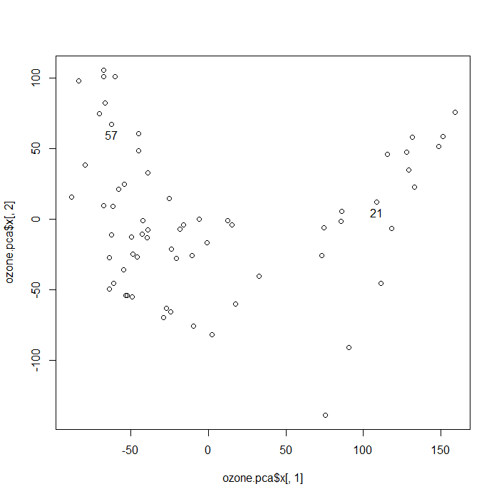

```{r setup, include=FALSE}
knitr::opts_chunk$set(echo = TRUE)
```


##### Load in data
```{r}
ozone = read.csv("ozone3.csv")
# Rows are sites, columns are days
colnames(ozone) = paste0("day", 1:ncol(ozone))
rownames(ozone) = paste0("site", 1:nrow(ozone))
```


##### Q1. Make a boxplot showing all the days, in chronological order (this is the order they are listed). Comment on any trends or outliers. Make sure you have appropriate title and axis labels.
```{r fig.width=10}
boxplot(ozone, names = 1:ncol(ozone), ylab = "Ozone", xlab = "Day", 
        main = "Boxplot of Ozone across 65 sites for each day")
```

##### Comment:

We can see from the boxplot, the Ozone is fluctuating over 89 days with a mean around 50. The variance does not seem to be constant. It has wider ranges on some days e.g. day 17, and smaller ranges on most of the other days. We can see some peak values (potential outliers) around Day 16 and Day 23.   

\pagebreak

##### Q2. One way to get a sense of skewness would be to look at the difference between median and mean. Compute this for each day, and make a histogram of the 89 resulting numbers. Comment on any interesting features
```{r}
diff = apply(ozone, 2, median) - apply(ozone, 2, mean)
hist(diff, main = "Histogram of the differences between median and mean of ozone",
     xlab = "Difference")
```

##### Comment:
We can see the mean is higher than the median. Hence we have positive skewness for our original data distribution.

\pagebreak

##### Q3. Plot the mean for each day as a time series (joined up with lines). 
```{r}
mean.df = apply(ozone, 2, mean)
plot.ts(mean.df, xlab = "Day", ylab = "Mean ozone", 
        main = "Mean ozone for 89 days")
```


##### Q4. Should we compute the principal components of this dataset based on the correlation matrix or covariance matrix (ie with or without scaling the data)? Explain your reasoning.  

##### Answer:
We don't need to scale the data since it is already on the same scale. Days with less variability are just less important. So we compute the principle components of this dataset based on the covariance matrix.  

\pagebreak

##### Q5. Make an image plot of your chose matrix. Comment on any features.
```{r}
library(ggplot2)
library(reshape2)

names(ozone) = as.character(1:ncol(ozone))
ozone.cov = melt(cov(ozone))

names(ozone.cov) = c("Day1", "Day2", "covariance")
ggplot(data = ozone.cov, aes(x = Day1, y = Day2, fill = covariance)) + 
  geom_tile() + labs(x = "Day", y = "Day", title = "Covariance bewteen days")
```

##### Comment:

We can see only some off-diagonal elements are in bright blue color, e.g. Day 22 and Day 16, this indicating high covariance. There are also some dark blue blocks, indicating strong negative correlations, e.g. Day 17 and Day 67. 

\pagebreak

##### Q6. Compute the principal components. Show the scree plot. How many components do you think we should use? Explain your reasoning. How much of the variability does this number of components represent?
```{r}
ozone.pca = prcomp(ozone)
plot(ozone.pca, main = "Variance of each principal component")
```

We should use 4 PC. The following output shows how much variability they account for.
```{r}
round(ozone.pca$sdev[1:4]^2/sum(ozone.pca$sdev^2), 2)
```

\pagebreak

##### Q7. Plot the first two principal component scores. Comment on interesting features.
```{r}
plot(ozone.pca$x[, 1:2])
```

##### Comment:

We can see 2 clusters divided by PC1 scores, at around 50. The group on the left seems to be close to the mean, where locates at (0, 0) on the PC score plot. 

\pagebreak

##### Q8. If there are any outliers, plot the time series for them and comment on how they differ from the mean. If there are groups (or arms of a horseshoe), plot a representative from the center of each group. 


##### Get the outliners at Site 25 using `identify()`

```{r}
plot(unlist(ozone[25, ]), type = "l", main = "Ozone for Site 25", 
     ylab = "Ozone levels for outlier", xlab = "Day", ylim = c(0, 100))
lines(mean.df, col = "red")
```

##### Comment:

Compared to the mean ozone level (the red line), Site 25 seems to have a lower level of ozone from Day 0 to Day 65, and exceeding the mean after Day 65. We can see Site 25 has rise and downs at very different time points from the mean. They could not align with each other. This is clearly a outlier.

\pagebreak

##### Get 2 sites from 2 group at Site 57 and 21 using `identify()`
```{r groups, fig.height=5, fig.width=8}

```

\pagebreak
```{r}
plot(unlist(ozone[57, ]), type = "l", main = "Ozone for Site 57", xlab = "Day")
lines(mean.df, col = "red")
```

\pagebreak
```{r}
plot(unlist(ozone[21, ]), type = "l", main = "Ozone for Site 21", xlab = "Day")
lines(mean.df, col = "red")

```

##### Comment:
We can see Site 57 and Site 21 align with the mean level (red line) to a large degree. We can see they have very similar patterns of rise and down with the mean. They all have peak values at around Day 18 and Day 57, valley values at around Day 40 and Day 85. The change of the variance seems to be similar as well.


